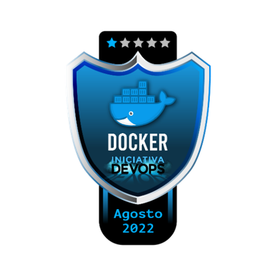

# Iniciativa DevOps | Day 1 - Docker

## :brain: Conceitos aprendidos
<<<<<<< HEAD
Projeto Iniciativa DevOps da @KubeDev | Aprendizado e Hands-on em ``Docker``

- O que são containers 
- Diferenças em relação a máquinas virtuais 
- O que é o Docker
- Comandos básicos para o uso de containers Docker`` 
- Construção de imagens Docker 
- Docker Hub 
- Boas práticas na construção de imagens
=======
Projeto Iniciativa DevOps da @KubeDev | Aprendizado e Hands-on em Docker

- ``O que são containers`` 
- ``Diferenças em relação a máquinas virtuais`` 
- ``O que é o Docker``
- ``Comandos básicos para o uso de containers Docker`` 
- ``Construção de imagens Docker`` 
- ``Docker Hub`` 
- ``Boas práticas na construção de imagens``
>>>>>>> 0e0a7ea22422bd497157b163949fae48402f0a37
